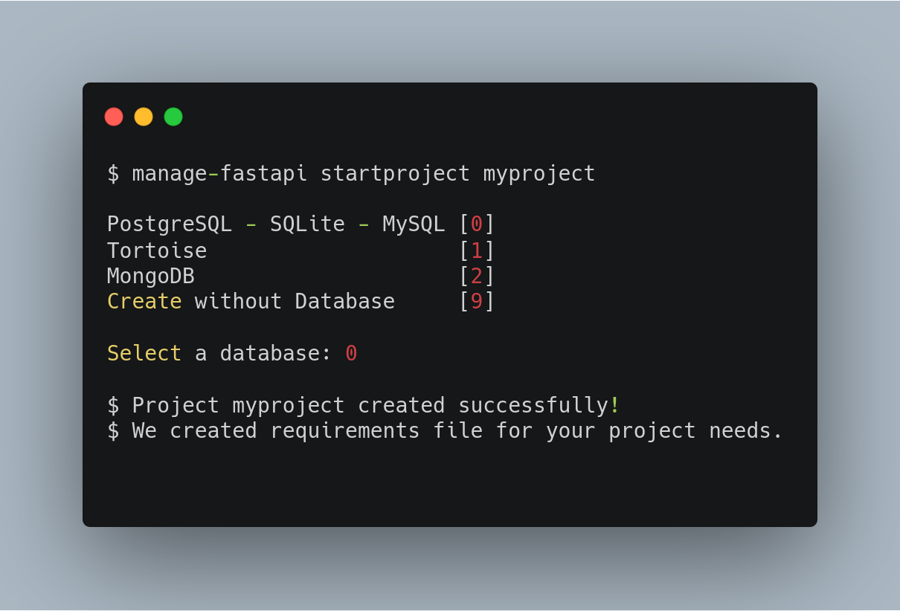

<h3 align="center">
    <strong>Managing FastAPI projects made easy</strong>
</h3>
<p align="center">

<a href="https://github.com/ycd/manage-fastapi" target="_blank">
    
    
</a>
<a href="https://github.com/ycd/manage-fastapi" target="_blank">
    
</a>
<br />
<a href="https://pypi.org/project/fastapi-utils" target="_blank">
    
</a>
    
    
</p>


---

**Documentation**: View it on [website](https://ycd.github.io/manage-fastapi/)

**Source Code**: View it on [Github](https://github.com/ycd/manage-fastapi/)

**Installation**: `pip install manage-fastapi`
---


##  Features :rocket:

* #### Creates customizable **project boilerplate.**
* #### Creates customizable **app boilerplate.**
* #### Handles the project structing for you.
* #### Get fancy information about your Pydantic models.
* #### Running development server.

## Starting a new project




## Example folder structure with two commands :open_file_folder:

```
manage-fastapi startproject fastproject
manage-fastapi startapp v1
```


```
fastproject/
├── __init__.py
├── main.py
├── core
│   ├── models
│   │   ├── database.py
│   │   └── __init__.py
│   ├── schemas
│   │   ├── __init__.py
│   │   └── schema.py
│   └── settings.py
├── tests
│   ├── __init__.py
│   └── v1
│       ├── __init__.py
│       └── test_v1.py
└── v1
    ├── api.py
    ├── endpoints
    │   ├── endpoint.py
    │   └── __init__.py
    └── __init__.py
```

## Getting information about our Pydantic models.

```
manage-fastapi showmodels
```


## With this command we are getting a fancy output of our models.

```
╔════════════════════════════════╗
║ item.py                        ║
║ -------                        ║
║ ItemBase                       ║
║ ItemCreate                     ║
║ ItemUpdate                     ║
║ ItemInDBBase                   ║
║ Item                           ║
║ ItemInDB                       ║
╚════════════════════════════════╝
╔════════════════════════════════╗
║ token.py                       ║
║ --------                       ║
║ Token                          ║
║ TokenPayload                   ║
╚════════════════════════════════╝
```


## Installation :pushpin:

`pip install manage-fastapi`


## Release Notes :mega:

### Latest Changes

### 0.1.41

* Quick fix for a little bug


### 0.1.4

* Changed project architecture
* Increased travis tests


### 0.1.3

* Make database optional
* Now Manage FastAPI has support for MongoDB, PostgreSQL, SQLite, MySQL, Tortoise ORM

### 0.1.2

* Add tests
* Fix and relocate success message 
* Add travis 

### 0.1.1

* Added documentation
* Fixed typos
* Additional response for successfuly creation.

### 0.1.0

* Prototype of project with two functionalities.

## License

This project is licensed under the terms of the MIT license.
