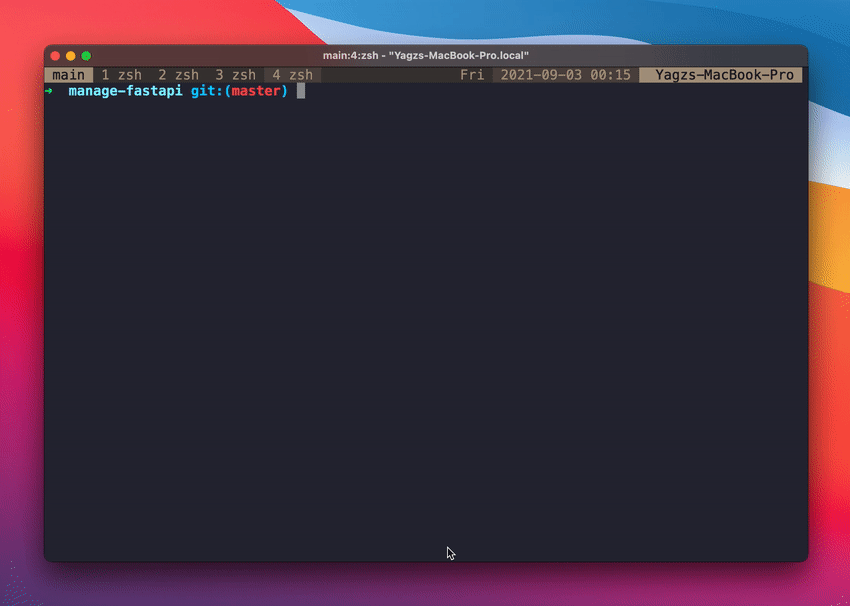

<div align="center">
<h1>manage-fastapi</h1>

[init-fastapi](https://github.com/toantranct94/init-fastapi) Project generator for FastAPI


<!--  -->

<p align="center">
    <a href="https://github.com/toantranct94/init-fastapi" target="_blank">
        
    <!-- </a>
        
         -->
    <br />
    <a href="https://pypi.org/project/init-fastapi" target="_blank">
        
    </a>
    
    
</p>
</div>


## Installation 📌

* Prerequisites
    * Python 3.7 +

This package can be installed by running

```python
pip install init-fastapi
```


## Getting started 🎈

Easiest way to start is using the defaults:

```bash
fastapi init [name]
```

## License

This project is licensed under the terms of the MIT license.
