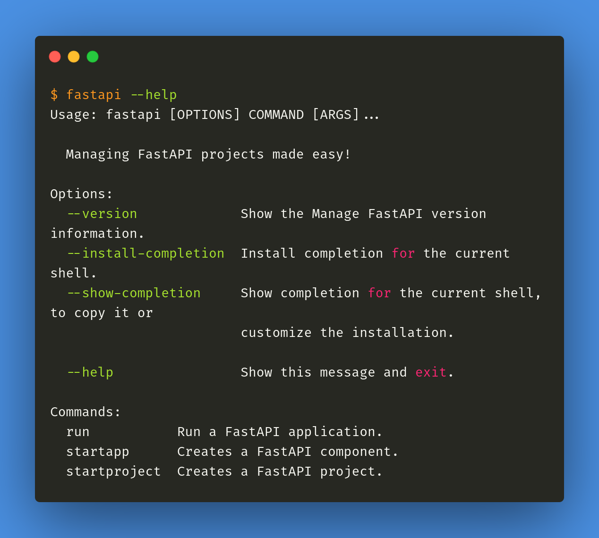
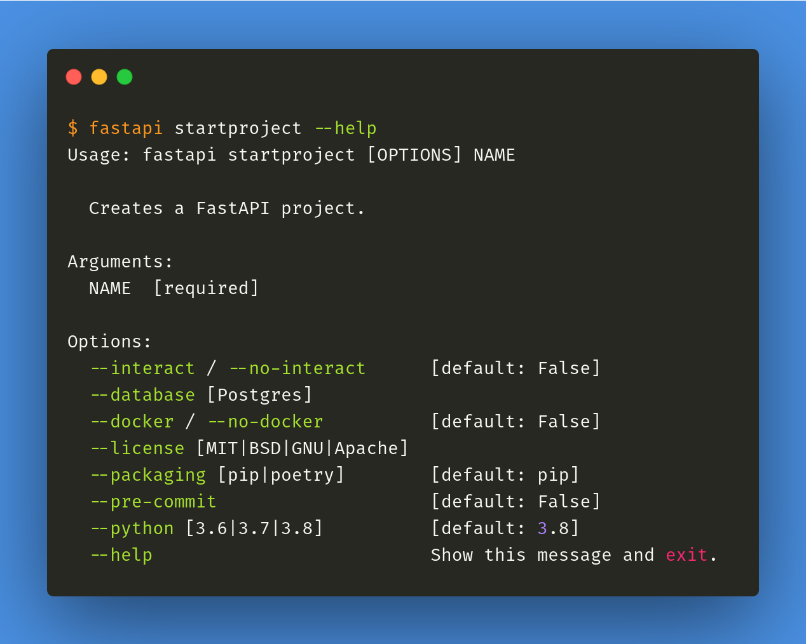

<h3 align="center">
    <strong>Manage FastAPI projects easily</strong>
</h3>
<p align="center">
    <a href="https://github.com/ycd/manage-fastapi" target="_blank">
        
    </a>
        
        
    <br />
    <a href="https://pypi.org/project/manage-fastapi" target="_blank">
        
    </a>
    
    
</p>


---

**Documentation**: View it on [website](https://ycd.github.io/manage-fastapi/)

**Source Code**: View it on [Github](https://github.com/ycd/manage-fastapi/)


---

##  Features 🚀

* #### Creates customizable **project boilerplate.**
* #### Creates customizable **app boilerplate.**
* #### Handles the project structuring for you.

## Installation

Manage FastAPI can be installed by running `pip install manage-fastapi`. It requires Python 3.7+ to run.

## Usage

To get started right away with sensible defaults:

```bash
fastapi startproject {name}
```

You can run _Manage FastAPI_ as a package if running it as a script doesn’t work:

```bash
python -m fastapi startproject {name}
```

## Command line options

Manage FastAPI has three commands for now. You can list them by running `fastapi --help`:



The idea is to have a highly customizable CLI, but at the same time a simple interface for new users. You can see the available options for `startproject` running `fastapi startproject --help`:



The other commands are already available but the current implementation is too shallow. More details about `startapp` and `run` commands will be provided once they have more functionalities, at the moment you can run `startapp` by just:

```bash
fastapi startapp {name}
```

On the other hand, the `run` command expects you to have a `startproject` structure:

```bash
fastapi run
```

## License

This project is licensed under the terms of the MIT license.
